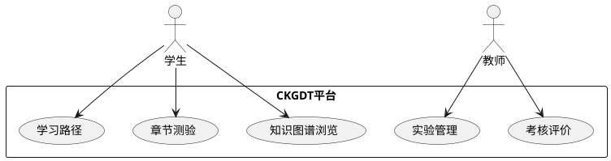

# 实验指导与 UML 参考

## 目录说明

本目录存放实验指导文档和 UML 建模参考资料，辅助完成课程实验任务。

## 实验指导文档

| 实验编号 | 实验名称 | 类型 | 对应课程目标 |
|----------|----------|------|-------------|
| 实验一 | 平台基础操作与图谱浏览 | 验证型 | 目标1 |
| 实验二 | 课程知识图谱建模实践 | 验证型 | 目标1 |
| 实验三 | 数字孪生场景设计与仿真 | 综合型 | 目标2 |
| 实验四 | 学习分析仪表盘解读与路径推荐 | 综合型 | 目标3 |
| 实验五 | 实验管理与AI批阅体验 | 验证型 | 目标4 |
| 实验六 | 综合项目——课程知识图谱构建与教学设计 | 综合型 | 目标1-4 |
| 实验七 | 教师端教学管理与考核评价实践 | 综合型 | 目标5 |
| 实验八 | 学生端自主学习与平台操作实践 | 验证型 | 目标1-4 |

## UML 参考资料

| UML 图类型 | 用途 | 适用场景 |
|------------|------|----------|
| 用例图 | 描述系统功能与参与者关系 | 需求分析阶段 |
| 类图 | 描述系统类结构及关系 | 系统设计阶段 |
| 序列图 | 描述对象间交互时序 | 功能实现阶段 |
| 活动图 | 描述业务流程或算法逻辑 | 流程分析阶段 |
| 状态图 | 描述对象状态转换 | 状态管理设计 |
| 组件图 | 描述系统组件及依赖 | 架构设计阶段 |
| 部署图 | 描述系统物理部署 | 部署运维阶段 |

## PlantUML 快速参考

## 使用说明

1. 实验指导文档按照实验编号组织，请按顺序完成
2. UML 参考资料可辅助实验报告中的建模部分
3. PlantUML 在线编辑：https://www.plantuml.com/plantuml
4. 如需补充新文档，请提交至本目录并更新本 README
