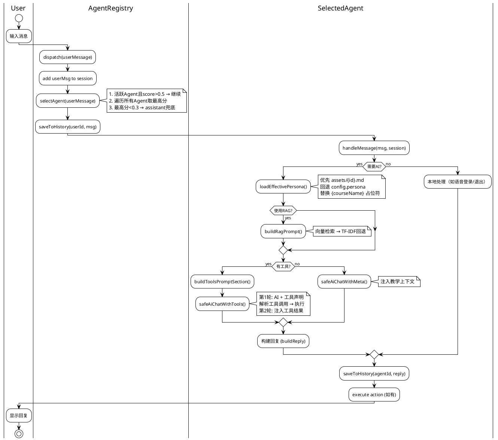
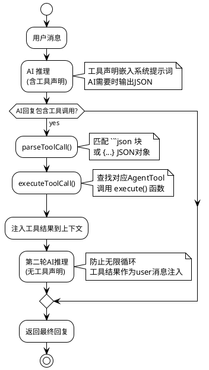

# CKGDT 多智能体系统 — 架构说明

> **版本**：v2.1.0 · **更新日期**：2026-07-03

---

## 一、系统架构总览

CKGDT 多智能体系统参考 OpenMAIC（清华大学开放式多智能体互动课堂）架构理念，采用 **Director-Agent** 模式：Director 根据用户消息选择最佳智能体，智能体处理后返回回复。

```
+-----------------------------------------------------------------------+
|                        UserMessage (user input)                       |
+-------------------------------------+---------------------------------+
                                      |
                                      v
+-----------------------------------------------------------------------+
|                     AgentRegistry (Director)                          |
|  +---------------------------------------------------------------+    |
|  |  _selectAgent() -> matchScore algorithm picks best Agent      |    |
|  |  1. Active Agent & score > 0.5 -> continue                    |    |
|  |  2. Scan all Agents -> pick highest matchScore                |    |
|  |  3. Highest score < 0.3 -> assistant fallback                 |    |
|  +---------------------------------------------------------------+    |
+-------------------------------------+---------------------------------+
                                      |
                 +--------------------+--------------------+
                 |                    |                    |
                 v                    v                    v
        +--------------+    +--------------+    +--------------+
        | VoiceAgent   |    | QuizAgent    |    | ...18 more   |
        | (voice nav)  |    | (quiz coach) |    | Pro Agents   |
        +------+-------+    +------+-------+    +------+-------+
               |                   |                   |
               v                   v                   v
+-----------------------------------------------------------------------+
|                       BaseAgent (abstract)                            |
|  - loadEffectivePersona()   -> assets/{id}.md or config.persona       |
|  - safeAiChatWithMeta()     -> AI call + teaching context injection   |
|  - buildRagPrompt()         -> RAG retrieval augmentation             |
|  - safeAiChatWithTools()    -> tool call loop (max 1 round)           |
|  - matchScore()             -> keyword match + context bonus          |
+-------------------------------------+---------------------------------+
                                      |
                                      v
+-----------------------------------------------------------------------+
|                         Infrastructure Layer                          |
|  +-----------+  +-----------+  +-----------+  +-----------+           |
|  | AiService |  |RagService |  | TwinSvc   |  | TeachCtx  |           |
|  | MultiProv |  | Semantic  |  | Twin      |  | Teaching  |           |
|  +-----------+  +-----------+  +-----------+  +-----------+           |
|  +-----------------------------------------------------------+       |
|  |               DatabaseHelper (59 tables)                  |       |
|  +-----------------------------------------------------------+       |
+-----------------------------------------------------------------------+
```

> **图注**：
> - **用户层**：语音输入(STT) / 文本输入 / AgentChatOverlay → AgentRegistry
> - **Director层**：AgentRegistry 根据 matchScore 算法选择最佳 Agent；OrchestratorAgent 支持多Agent链式编排
> - **Agent层**：19个专业Agent，分6类（学习辅导/教学管理/内容生成/平台工具/安全伦理/兜底）
> - **基础设施层**：AiService(多Provider) / RagService(语义检索) / TwinService(孪生画像) / TeachingContext(教学上下文) / DatabaseHelper(59张表) / AgentCallLogDao(审计日志)

---

## 二、BaseAgent 抽象基类

### 类定义

```dart
abstract class BaseAgent {
  AgentConfig get config;                                                    // 配置
  Future<AgentMessage> handleMessage(String userMessage, AgentSession session);  // 处理消息
  double matchScore(String userMessage, AgentSession session);               // 匹配分数
  String get greeting;                                                       // 欢迎语
  List<String> get quickCommands;                                            // 快捷指令
}
```

### 生命周期

```
初始化 → handleMessage() → AI推理 → 工具调用(可选) → 构建回复 → 返回
         │                                        │
         ├─ loadEffectivePersona()                ├─ buildReply()
         ├─ buildAiMessages()                     ├─ buildReplyFromResult()
         ├─ safeAiChatWithMeta()                  └─ parseToolCall() → executeToolCall()
         ├─ safeAiChatWithRag()
         └─ safeAiChatWithTools()
```

### Persona 加载优先级

```
1. assets/agent_prompts/{config.id}.md  （文件存在则覆盖）
   ↓ 文件不存在
2. config.persona  （代码中 const 定义）
   ↓ 替换占位符
3. promptWithCourse()  （替换 {courseName}、{chapterCount} 等）
```

### AI 调用方法

| 方法                | 说明                               | RAG | 工具 |
| ------------------- | ---------------------------------- | --- | ---- |
| `safeAiChatWithMeta()`   | 基础AI调用，注入教学上下文          | ❌  | ❌   |
| `safeAiChatWithRag()`    | RAG增强版AI调用                    | ✅  | ❌   |
| `safeAiChatWithTools()`  | 带工具调用循环的AI调用（最多1轮）   | ✅/❌ | ✅   |

### 工具调用流程

```
用户消息 → AI 推理（含工具声明） → 解析 JSON 工具调用
                                        │
                              ┌─────────┴─────────┐
                              │                    │
                          有工具调用            无工具调用
                              │                    │
                         执行工具              直接返回
                              │
                     注入工具结果到上下文
                              │
                     第二轮 AI 推理（无工具声明）
                              │
                           最终回复
```

---

## 三、AgentRegistry 单例

### 注册与初始化

```dart
class AgentRegistry {
  static final AgentRegistry instance = AgentRegistry._();
  final Map<String, BaseAgent> _agents = {};

  void initialize() {
    _register(VoiceAgent());
    _register(GraphAgent());
    _register(QuizAgent());
    // ... 共19个Agent
    _register(AssistantAgent());  // 兜底，最后注册
  }
}
```

### Director 编排流程

```dart
Future<AgentMessage> dispatch(String userMessage) async {
  // 1. 添加用户消息到会话
  session.messages.add(userMsg);

  // 2. Director 选择最佳智能体
  final agent = _selectAgent(userMessage);

  // 3. 保存历史
  _saveToHistory(agent.config.id, 'user', userMessage);

  // 4. 智能体处理
  final reply = await agent.handleMessage(userMessage, session);

  // 5. 保存回复（含Token用量）
  _saveToHistory(agent.config.id, 'assistant', reply.content, ...);

  // 6. 执行动作（如有）
  if (reply.action != null) onAction?.call(reply.action!);

  return reply;
}
```

---

## 四、AgentConfig 配置模型

```dart
class AgentConfig {
  final String id;                    // 唯一标识
  final String name;                  // 显示名称
  final String emoji;                 // 图标Emoji
  final String description;           // 简短描述
  final String persona;               // 系统提示词（人设）
  final int priority;                 // 优先级 1-10
  final List<String> keywords;        // 触发关键词
  final List<String> capabilities;    // 能力标签
  final bool requiresAi;              // 是否需要AI API
  final bool useRag;                  // 是否启用RAG
  final List<AgentTool> tools;        // 可调用工具列表
  final List<String> usageSteps;          // 使用步骤
  final List<AgentCase> classicCases;     // 经典案例
  final List<String> allowedRoles;        // 允许的角色
}
```

### AgentTool 工具定义

```dart
class AgentTool {
  final String name;                                              // 工具名
  final String description;                                       // 描述
  final Map<String, String> parameters;                           // 参数名→说明
  final Future<String> Function(Map<String, dynamic> params) execute;  // 执行函数
}
```

工具通过 `toPromptDeclaration()` 生成声明文本，嵌入系统提示词中。AI在回复中输出 `{"tool": "name", "params": {...}}` 格式的JSON，由 BaseAgent 解析并执行。

---

## 五、AgentSession 会话管理

```dart
class AgentSession {
  final String id;                                       // 会话ID
  final List<AgentMessage> messages;                     // 消息历史
  String? activeAgentId;                                 // 当前活跃Agent
  final DateTime createdAt;                              // 创建时间

  List<AgentMessage> recentMessages([int count = 10]);   // 最近N条
  String? get lastUserMessage;                           // 最近用户消息
}
```

**消息历史管理**：
- 最近 8 条消息用于构建 AI 上下文（`buildAiMessages()`）
- 消息保存到 `ai_chat_history` 表（含 Token 用量和模型信息）
- 会话可重置（`resetSession()`）

---

## 六、matchScore 匹配算法

```dart
double matchScore(String userMessage, AgentSession session) {
  double score = _keywordScore(userMessage);    // 关键词匹配
  if (session.activeAgentId == config.id) {
    score += 0.3;                               // 上下文连续性加分
  }
  return score.clamp(0.0, 1.0);
}
```

**关键词评分规则**：

| 匹配关键词数 | 得分 |
| ------------ | ---- |
| 0 个         | 0.0  |
| 1 个         | 0.4  |
| 2 个         | 0.6  |
| 3+ 个        | 0.8  |

**选择算法**：

```
1. 当前活跃 Agent 且 score > 0.5 → 继续使用（上下文连续性）
2. 遍历所有 Agent，取 score 最高的
3. 最高分 < 0.3 → 使用 assistant 兜底
```

---

## 七、OrchestratorAgent 多智能体编排

### 链式编排

当一个任务需要多个Agent协同时，使用 `OrchestratorAgent` 进行链式编排：

```dart
class OrchestratorAgent {
  Future<OrchestratorResult> runChain({
    required String userMessage,
    required AgentSession session,
    required List<String> agentChain,  // Agent ID 列表
  }) async { ... }
}
```

### 执行流程

```
输入消息 → Agent A 处理 → 输出A → Agent B 处理 → 输出B → Agent C 处理 → 最终输出
           │                │                │
           └── Zone 注入 chainId + step ─────┘
               (用于 agent_call_logs 关联追踪)
```

### 预定义编排链

| 链名       | Agent 链                | 场景               |
| ---------- | ----------------------- | ------------------ |
| `labGrading` | safety → grading → ethics | 实验报告安全增强批阅 |

### chainId 日志追踪

每次 `runChain()` 自动生成唯一 `chainId`（基于时间戳），通过 Dart Zone 注入到内层 Agent 的 `safeAiChatWithMeta()` 中，写入 `agent_call_logs.chain_id` 和 `agent_call_logs.chain_step`，实现整条链路的关联追踪。

---

## 八、SpecialAgentTools 共享工具层

`SpecialAgentTools` 是发布前专项能力的工具层，把智能体的自然语言请求落到本地业务闭环：

```dart
class SpecialAgentTools {
  static final SpecialAgentTools instance = SpecialAgentTools._();

  // 图谱生成
  Future<String> generateKnowledgeGraph({...});

  // 测验出题
  Future<String> generateQuizQuestions({...});

  // 实验任务生成
  Future<String> generateLabTask({...});

  // 课件生成
  Future<String> generateCourseware({...});

  // 达成度报告
  Future<String> generateAchievementReport({...});
}
```

**设计原则**：
- 不依赖前端页面状态，可被智能体、语音助手或按钮入口复用
- 统一调用 `AiService.chatWithMeta()` 生成内容
- 结果落库到对应业务表

---

## 九、AgentChatOverlay 7种导航动作

智能体可通过 `AgentAction` 触发UI层的导航动作：

| 动作类型           | 说明           | 参数              |
| ------------------ | -------------- | ----------------- |
| `navigate_tab`     | 切换底部Tab    | `keyword`, `label`  |
| `navigate_sub_page`| 打开子页面     | `keyword`           |
| `inner_tab`        | 切换页面内Tab  | `page`, `tab`       |
| `go_back`          | 返回上一页     | —                   |
| `pop_to_root`      | 回到首页       | —                   |
| `exit_app`         | 退出应用       | —                   |
| `navigate_login`   | 跳转到登录页   | —                   |

```dart
class AgentAction {
  final String type;                          // 动作类型
  final Map<String, dynamic> params;          // 参数
  final String? description;                  // 描述
}
```

---

## 十、语音集成（STT → Agent → TTS）

```
+--------------+     +--------------+     +--------------+     +--------------+
|  Xunfei STT  | --> | VoiceAgent   | --> |AgentRegistry | --> |  TTS  Synth   |
|  WebSocket   |     | Intent Recog |     |  dispatch()  |     |  Read aloud   |
+--------------+     +--------------+     +--------------+     +--------------+
```

**VoiceAgent 快速通道**（不经过AI，保证离线可用）：
- 登录：`"登录 206004"` → 提取学号 → 自动登录
- 退出：`"退出登录"` / `"退出系统"`
- 返回：`"返回"` / `"回到首页"`

**AI通道**：自然语言理解 → JSON 结构化输出 → 导航动作执行

---

## 十一、RAG 检索增强（RagService）

### 检索优先级

```
1. 向量索引（rag_embeddings 表非空）→ retrieveContextVector（语义检索）
   ↓ 索引为空/失败
2. TF-IDF + 关键字回退 → retrieveContext（传统检索）
```

### 构建流程

```dart
Future<String> buildRagPrompt(String userMessage) async {
  final persona = await loadEffectivePersona();  // 加载基础 prompt
  if (!config.useRag) return persona;

  // 优先向量检索
  var context = await _ragService.retrieveContextVector(userMessage, topK: 6);

  // 回退到 TF-IDF
  if (context.isEmpty) {
    context = await _ragService.retrieveContext(userMessage, ...);
  }

  if (context.isEmpty) return persona;

  return '$persona\n\n$context\n\n请基于以上课程知识库的参考资料回答...';
}
```

**支持RAG的Agent**：`tutor`、`quiz`、`graph`、`mobile_expert`、`assistant`、`digital_twin`

---

## 十二、Prompt 加载机制（PromptLoader）

```
PromptLoader.load(agentId)
  │
  ├─ 1. 内存缓存命中 → 直接返回
  │
  ├─ 2. assets/agent_prompts/{agentId}.md 存在 → 缓存并返回
  │
  └─ 3. 文件不存在 → 返回 null → 调用方回退到 config.persona
```

**覆盖策略**：assets 文件存在 = 覆盖代码中 const persona。支持增量迁移，改动频繁的 prompt 抽成 .md 文件，其他保持 const。

**缓存管理**：
- 内存缓存上限 48 个
- LRU 淘汰策略
- 支持热更新：`PromptLoader.invalidate()` 清除缓存

---

## 十三、教学上下文注入（AgentTeachingContextService）

每个 Agent 调用 AI 时，自动注入当前课程的实时数据：

```dart
## 当前课程教学上下文

- 平台：课程知识图谱与数字孪生（CKGDT）
- 当前课程：{courseName}
- 章节数：{chapterCount}

### 章节
- 第1章 课程知识图谱基础
- 第2章 课程数据建模与资源治理
...

### 数据概览
- 知识图谱：{conceptCount} 个概念，{relationCount} 条关系
- 题库与资源：{questionCount} 道题，{resourceCount} 个资源
- 实验与作品：{labTaskCount} 个实验任务，{workCount} 个学生作品
- 考核与达成：{groupCount} 个考核分组，{objectivesCount} 个课程目标

### 工作原则
- 所有建议必须服务当前课程
- 回答教师时优先连接"教学设计、实验任务、考核评价、达成改进"
- 回答学生时优先连接"知识图谱学习、测验练习、实验提交、作品改进"
```

---

## PlantUML 架构图

```plantuml
@startuml CKGDT Multi-Agent Architecture
!theme plain

skinparam backgroundColor white
skinparam componentStyle rectangle

package "用户层" {
  [语音输入 STT] as STT
  [文本输入] as TextIn
  [AgentChatOverlay] as Overlay
}

package "Director 层" {
  [AgentRegistry] as Registry
  [OrchestratorAgent] as Orch
}

package "Agent 层" {
  [BaseAgent <<abstract>>] as Base

  package "学习辅导类" {
    [VoiceAgent 🎙️] as Voice
    [TutorAgent 🎓] as Tutor
    [QuizAgent 📝] as Quiz
    [GraphAgent 🕸️] as Graph
  }

  package "教学管理类" {
    [LabAgent 🔬] as Lab
    [AssessmentAgent 📊] as Assess
    [WorksAgent 🎨] as Works
    [AchievementAgent 🏆] as Achieve
    [GradingAgent 📝] as Grade
  }

  package "内容生成类" {
    [CoursewareAgent 📚] as Courseware
    [DocConverterAgent 📄] as DocConv
    [ArchiveAgent 📦] as Archive
  }

  package "平台工具类" {
    [RepoAgent 📦] as Repo
    [DigitalTwinAgent 🔄] as Twin
    [CaseDemoAgent 🧩] as Case
    [MobileExpertAgent 📱] as Mobile
  }

  package "安全伦理类" {
    [SafetyAgent 🛡️] as Safety
    [EthicsAgent 🏛️] as Ethics
  }

  package "兜底类" {
    [AssistantAgent 🤖] as Assistant
  }
}

package "基础设施层" {
  [AiService\n多Provider] as AI
  [RagService\n语义检索] as RAG
  [SpecialAgentTools\n共享工具] as Tools
  [PromptLoader\nPrompt管理] as PL
  [AgentTeachingContext\n教学上下文] as TC
  [DatabaseHelper\n59张表] as DB
  [AgentCallLogDao\n审计日志] as Log
}

' 连接
STT --> Voice
TextIn --> Registry
Overlay --> Registry

Registry --> Base : dispatch()
Base --> Voice
Base --> Tutor
Base --> Quiz
Base --> Graph
Base --> Lab
Base --> Assess
Base --> Works
Base --> Achieve
Base --> Grade
Base --> Courseware
Base --> DocConv
Base --> Archive
Base --> Repo
Base --> Twin
Base --> Case
Base --> Mobile
Base --> Safety
Base --> Ethics
Base --> Assistant

Voice --> AI
Tutor --> AI
Tutor --> RAG
Quiz --> AI
Quiz --> RAG
Quiz --> Tools
Graph --> AI
Graph --> RAG
Graph --> Tools
Lab --> AI
Lab --> Tools
Assess --> AI
Assess --> Tools
Works --> AI
Works --> Tools
Achieve --> AI
Achieve --> Tools
Grade --> AI
Courseware --> AI
Courseware --> Tools
DocConv --> AI
Archive --> AI
Repo --> AI
Repo --> Tools
Twin --> AI
Twin --> RAG
Case --> AI
Case --> Tools
Mobile --> AI
Mobile --> RAG
Safety --> AI
Ethics --> AI
Assistant --> AI
Assistant --> RAG

Base --> PL
Base --> TC
Base --> Log
Base --> DB

Orch --> Registry

@enduml
```






