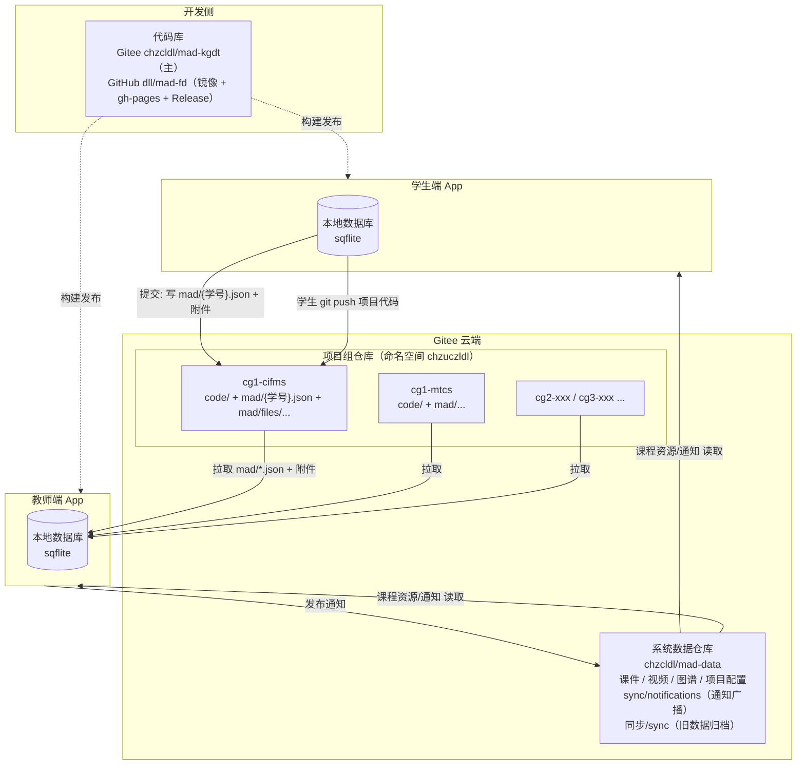
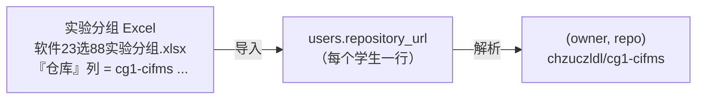
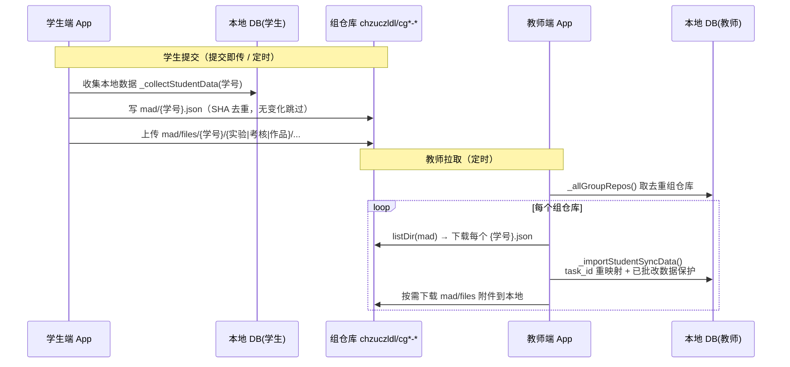

# 项目仓库设计（CKGDT 仓库与数据架构）

> 本文档说明系统涉及的 **4 类仓库/存储** 及其职责、数据流向与目录规范。
> 配套代码：`lib/services/sync_service.dart`（分组项目仓库同步）、`lib/services/gitee_service.dart`、
> `lib/services/course_resource_service.dart`、`lib/services/courseware_download_service.dart`。

---

## 1. 总览：4 类仓库/存储

| 类别 | 位置 | 职责 | 谁写 | 谁读 |
|------|------|------|------|------|
| **代码库** | Gitee `chzcldl/mad-kgdt`（主）<br>GitHub `dll/mad-fd`（镜像） | 应用源码、版本发布、Web 部署(gh-pages) | 开发者 | 开发者 / CI |
| **系统数据仓库** | Gitee `chzcldl/mad-data` | 课程资源（课件/视频/图谱/项目配置）、通知广播、旧同步数据归档 | 教师端 App / 维护者 | 全体 App |
| **本地数据库** | 设备本地 sqflite `knowledge_graph.db` | 运行时单一真相源（59+ 表） | App 自身 | App 自身 |
| **项目组仓库** | Gitee `chzuczldl/cg{1,2,3}-*`（**一组一仓库**） | 学生项目代码 + 学生学习/实验/考核/作品同步数据 | 学生（代码）<br>学生端 App（mad/ 数据） | 教师端 App（拉取） |

> 旧的中心仓库 `osgisOne/mad-fd` 已**弃用**（曾把全体学生数据集中到 `sync/students/`，导致仓库膨胀超配额）。
> 新模型把学生数据**分散**到各自的项目组仓库，App 按需拉取，从根本上避免中心仓库膨胀。

---

## 2. 架构总图



ASCII 简版：

```
                    代码库 chzcldl/mad-kgdt (+ GitHub dll/mad-fd 镜像)
                              │ 构建发布
                 ┌────────────┴────────────┐
            学生端 App                  教师端 App
            (本地 sqflite)              (本地 sqflite)
                 │  ▲                        ▲  │
   写 mad/{学号} │  │ 读课程资源/通知         │  │ 拉取 mad/*.json
   + 附件        │  │                        │  │
                 ▼  │                        │  ▼
        项目组仓库 chzuczldl/cg*-*    ◄───────┘   系统仓库 chzcldl/mad-data
        (代码 + mad/ 同步数据)                     (课件/视频/图谱/通知/归档)
```

---

## 3. 各仓库详述

### 3.1 代码库
- **Gitee `chzcldl/mad-kgdt`**：主仓库（master + tag）。历史已用 `git filter-repo` 清除旧 `sync/` 学生数据，体积 ~330MB。
- **GitHub `dll/mad-fd`**：镜像，承载 `gh-pages`（Web 站 `https://dll.github.io/mad-fd/`）与 GitHub Release 资产。
- 发布流程见 `CLAUDE.md` 的"双仓库发布流程"。

### 3.2 系统数据仓库 `chzcldl/mad-data`
- 课程资源：`课件/`、`视频/`、`图谱/`、`项目/`、`course_config` 等（`CourseResourceService.sysRepo = 'mad-data'`，`courseware_download_service` 远程兜底）。
- **通知广播**：`sync/notifications/notif_{id}_{ts}.json`（教师端 `SyncService.uploadNotification` 写，学生端 `downloadNotifications` 读）。
- **旧同步数据归档**：`同步/sync/students/...`（从旧 mad-fd 迁出，仅留档）。
- `SyncService.systemRepoOwner/systemRepoName = chzcldl/mad-data`，用于通知与连接诊断。

### 3.3 本地数据库（sqflite）
- 文件 `knowledge_graph.db`，首启从 `assets/learning_data.db` 复制；59+ 表，运行时单一真相源。
- 同步只在"本地 DB ⇄ 组仓库 JSON"之间双向搬运，不改变本地 DB 的权威地位。

### 3.4 项目组仓库 `chzuczldl/cg{1,2,3}-*`（核心）
- **一组一仓库**：同组多名学生共用一个仓库；仓库名来自实验分组 Excel 的"仓库"列（如 `cg1-cifms`、`cg1-mtcs`）。
- 内容布局：
  ```
  chzuczldl/cg1-cifms/
  ├── <学生项目代码…>            ← 学生直接 git push
  ├── mad/
  │   ├── 2023210646.json        ← 该学生的学习/测验/实验/考核/作品结构化数据
  │   ├── 2023210589.json
  │   └── files/
  │       └── 2023210646/
  │           ├── 实验/xxx.pdf
  │           ├── 考核/xxx.pdf
  │           └── 作品/xxx.mp4
  └── README.md
  ```

---

## 4. 学生→仓库 映射来源



- 导入：`admin/data_import_page_native.dart` 识别表头含『仓库/Gitee』的列 → 写 `users.repository_url`。
- 解析：`SyncService._parseRepoSpec()` 支持三种写法 —
  - 完整 URL `https://gitee.com/chzuczldl/cg1-cifms` → 解析 owner/repo；
  - `owner/repo`；
  - 裸仓库名 `cg1-cifms` → 默认命名空间 `chzuczldl` 下该仓库。
- 教师端去重：`SyncService._allGroupRepos()` 扫描所有 `users.repository_url` 得到去重的组仓库集合。

---

## 5. 数据同步流程



**关键不变量（沿用旧逻辑，未改动）**：
- **task_id 重映射**：学生端/教师端 `lab_tasks` 自增 ID 不同，按 `title` 自然键匹配重映射。
- **批改数据保护**：导入时 `score IS NOT NULL` 的 `lab_submissions`/`student_reports`/`student_works` 不被覆盖。
- **SHA 去重**：`mad/{学号}.json` 内容无变化则跳过 commit。

---

## 6. 权限与 Token
- 同步使用独立读写 Token（`sync_gitee_token`，集中于 `GiteeCredentials.syncToken`）。
- 该 Token 需对命名空间 **`chzuczldl`**（组仓库）有**写**权限（学生端写 mad/），教师端只需**读**权限拉取。
- 通知/诊断走 `chzcldl/mad-data`，需对其有读写权限。

---

## 7. 与旧模型的差异（迁移要点）

| 维度 | 旧（已废弃） | 新（当前） |
|------|--------------|------------|
| 学生数据位置 | 中心仓 `osgisOne/mad-fd:sync/students/{学号}.json` | 各组仓库 `chzuczldl/cg*-*:mad/{学号}.json` |
| 附件位置 | `sync/students/{学号}/{分类}/` | `mad/files/{学号}/{分类}/` |
| 教师获取 | 读中心仓单目录 | 遍历去重组仓库逐个拉取 |
| 仓库来源 | 固定常量 | 实验分组 Excel 仓库列 → `users.repository_url` |
| 膨胀风险 | 高（全员集中 + 媒体） | 低（按组分散，代码与数据同库） |

> 旧 `sync/` 数据已迁至 `chzcldl/mad-data` 的 `同步/sync`，并从 `mad-fd` 历史中清除。
